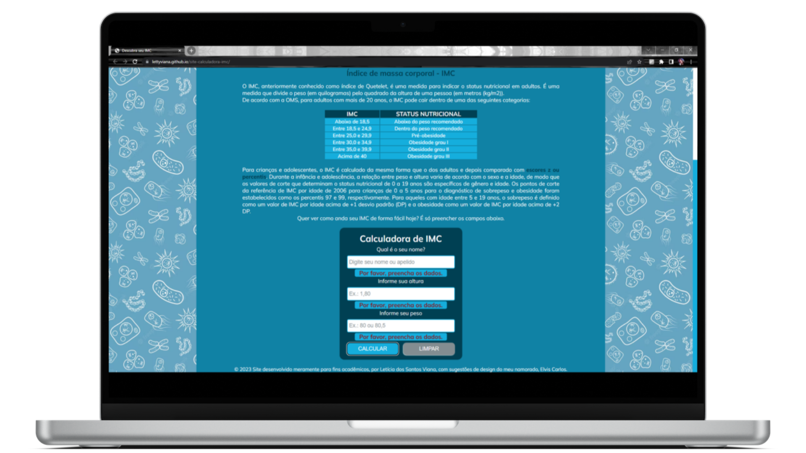
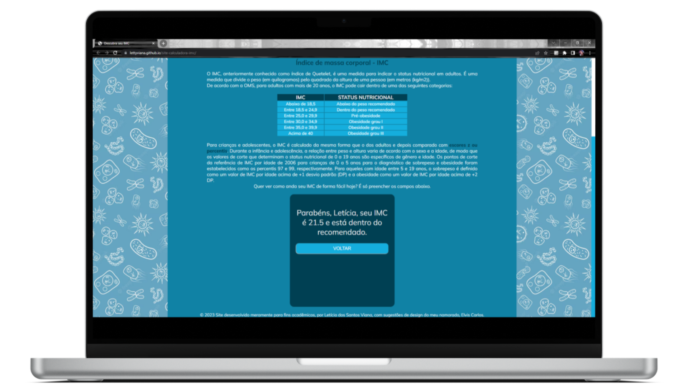
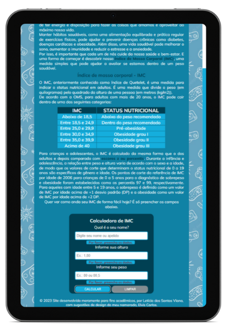
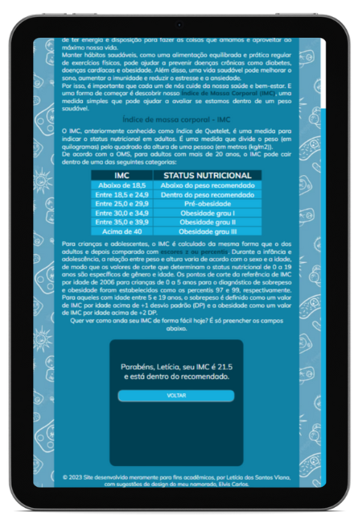
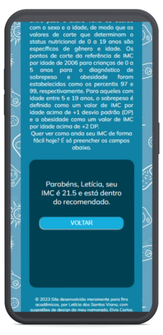

# **Descubra seu IMC de Forma Fácil**

Neste site simples, apresento informações sobre o índice de massa corporal, a importância de conhecê-lo e como calculá-lo por meio de uma calculadora de IMC funcional em que o usuário insere seu primeiro nome ou apelido e seu peso e altura e recebe o resultado com o valor de seu IMC e se está dentro, acima ou abaixo do peso recomendado pela Organização Mundial da Saúde (OMS).

    

#

## **Índice:**

1. [Minhas implementações](#1-minhas-implementações)
2. [Linguagens/tecnologias utilizadas](#2-linguagenstecnologias-utilizadas)
3. [Imagens do projeto](#3-imagens-do-projeto)
4. [Como usar](#4-como-usar)
5. [Autora e contato](#5-autora-e-contato)
6. [Status do Projeto](#6-status-do-projeto)

#

### **1. Minhas implementações**

- Design responsivo para desktop (1920p x 1080p), tablet (768p x 1174p) e celular (320p a 375p x 658p a 933p);
- Validação de dados inseridos para que a calculadora retorne uma mensagem caso nenhum dos campos obrigatórios sejam preenchidos ou preenchidos incorretamente;
- Mensagens personalizadas de acordo com o resultado;
- Botões para calcular, limpar os dados inseridos e voltar à página inicial da calculadora;

#

### **2. Linguagens/tecnologias utilizadas**

 
    
    
    

 

#

### **3. Imagens do projeto**

     
     
     
    
    
    
    
    
    

#

### **4. Como usar**

Para usar, acesse o link abaixo.

[Link para abrir o site do projeto](https://lettyviana.github.io/site-calculadora-imc/)

#

### **5. Autora e contato**

#

### **6. Status do projeto**
- [x] Funcional
- [x] Responsivo para desktop (1920p x 1080p), tablet (768p x 1174p) e celular (320p a 375p x 658p a 933p);
- [x] Concluído, porém sujeito a modificações.
